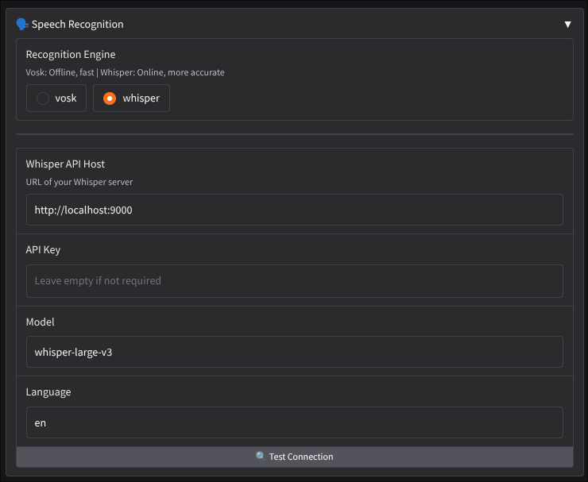
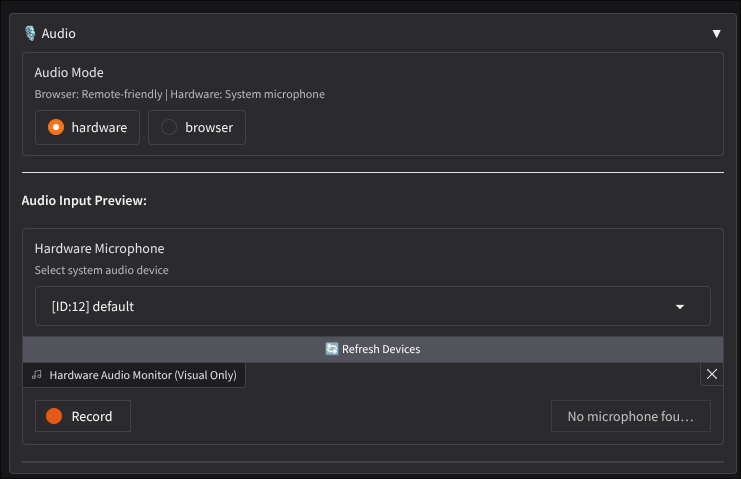
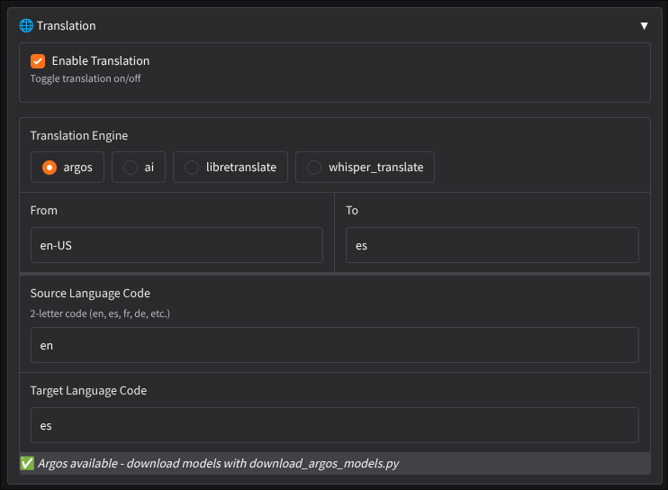
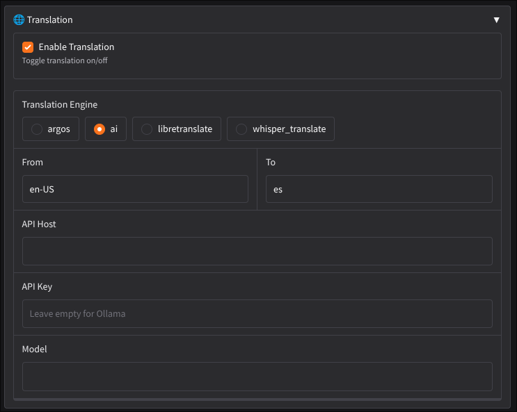
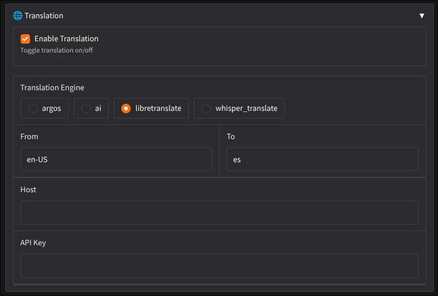
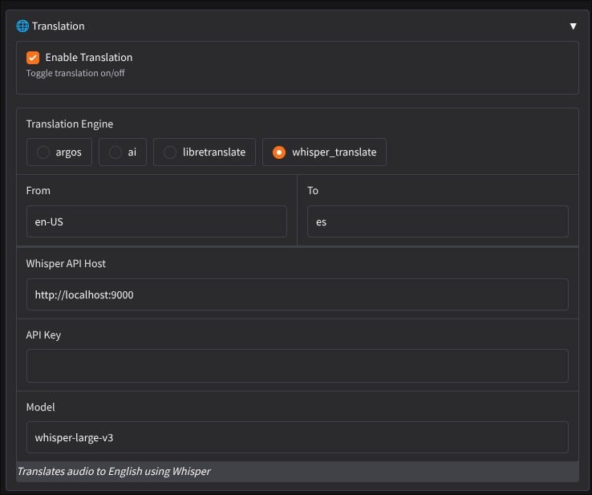
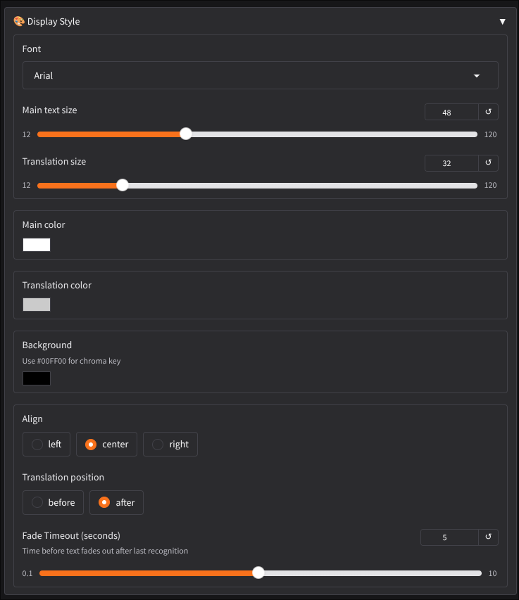

# ⚠️ **AI ALERT**

As a software developer with limited Python expertise, I directed the development of srt-translator by iteratively prompting AI language models (Claude and DeepSeek) to generate the majority of the code. Through systematic debugging, precise requirements, and continuous validation of the AI's output, I guided the project from concept to a fully functional application. This process demonstrates my ability to leverage AI tools effectively while retaining full ownership of problem‑solving and architectural decisions.

# 🎤 Voice Translator - Real-time Speech Recognition & Translation

A powerful, OBS-compatible voice recognition and translation app built with Python and Gradio. Supports multiple translation backends including AI models, offline Argos Translate, Whisper API, and LibreTranslate.

## ✨ Features

### Core Functionality

- **Real-time Voice Recognition** using Vosk (offline, open‑source) or Whisper API (online, high accuracy)
- **Multiple Translation Backends**:
  - **Argos Translate** – offline, open‑source translation (no internet required)
  - **AI‑powered translation** – OpenAI‑compatible endpoints (Ollama, OpenAI, etc.)
  - **Whisper Translate** – direct audio translation via Whisper API
  - **LibreTranslate** – self‑hosted or cloud translation service
  - **Internal translation** – using `translators` library (Google Translate, etc.)
- **Independent Session Management** – each browser tab runs its own isolated session
- **Pop‑out Display** – separate window for OBS overlay, updates via polling
- **Interim Results** – show partial recognition as you speak
- **Multi‑language Support** – recognize and translate between many languages

### Display Customization

- **Font, Size, Color** – fully customizable for both recognized and translated text
- **Text Alignment** – left, center, or right
- **Translation Position** – before or after the recognized text
- **Background Color** – set any color (use `#00FF00` for chroma key)
- **Fade Timeout** – automatically fade text after a configurable pause

### Advanced Features

- **Microphone Selection** – choose from available input devices
- **Vosk Model Management** – load models from local `models/` directory
- **Argos Model Management** – download and install offline translation models with `download_argos_model.py`
- **Whisper API Integration** – use any OpenAI‑compatible Whisper server (e.g., `whisper.cpp`, `faster-whisper`)
- **Docker Support** – easy deployment with Docker/Docker Compose
- **Comprehensive Logging** – real‑time logs in UI and persistent file logs
- **Session Cleanup** – automatic cleanup of inactive sessions

## Screenshots

### Speech recognition

#### Vosk


#### Whisper



### Audio options

#### Hardware



### Translation

#### Argos



#### AI



#### Libretranslate



#### Whisper translate



### Display style




## 📋 Requirements

### System Requirements

- **Python 3.11 or 3.12** (recommended – Python 3.14 may have package compatibility issues)
- PortAudio (for audio input)
- Vosk models (download separately)
- (Optional) Argos Translate models for offline translation
- (Optional) Whisper server for online transcription/translation

### Python Dependencies

- gradio>=4.44.0
- vosk>=0.3.45
- sounddevice>=0.4.7
- numpy>=1.26.0,<2.0.0
- requests>=2.31.0
- translators>=5.9.1
- argostranslate
- langdetect

## 🚀 Installation

### Method 1: Local Installation

1. **Clone or download this repository**

2. **Install system dependencies** (if needed)

   **Ubuntu/Debian:**

   ```bash
   sudo apt-get update
   sudo apt-get install portaudio19-dev python3-pyaudio
   ```

   **macOS:**

   ```bash
   brew install portaudio
   ```

3. **Create and activate a virtual environment**

   ```bash
   python3 -m venv venv
   source venv/bin/activate # On Windows: venv\Scripts\activate
   ```

4. **Install Python dependencies**

   ```bash
   pip install -r requirements.txt
   ```

5. **Download Vosk models**

   Use the included `download_vosk_models.py` script:

   ```bash
   python download_vosk_models.py en-us-small # light English model
   python download_vosk_models.py en-us # full English model
   python download_vosk_models.py es fr de # multiple languages
   ```

   Models are placed in the `models/` directory.

6. **(Optional) Download Argos Translate models for offline translation**

   ```bash
   python download_argos_model.py en es # install English→Spanish
   python download_argos_model.py --common # install a set of common pairs
   ```

   Models are stored in `argos_models/`.

7. **Run the application**

   ```bash
   python app.py
   ```

   Open your browser at http://localhost:7860.

### Method 2: Docker Deployment

1. Build the Docker image

   ```bash
   docker-compose build
   ```

2. Place Vosk models in `./models/` (created automatically if missing)

3. Start the container

   ```bash
   docker-compose up -d
   ```

4. Access the application at `http://localhost:7860`

## 🎮 Usage

### Basic Setup

1. **Select Recognition Engine:**
   - **Vosk** (offline, fast) – choose a model from the dropdown
   - **Whisper** (online, more accurate) – configure Whisper API host and model

2. **Choose Audio Mode:**
   - **Hardware** – uses system microphone (select device)
   - **Browser** – uses browser’s microphone (useful for remote access)

3. **Configure Translation** (optional):
   - **Argos** – offline translation using downloaded Argos models
   - **AI** – OpenAI‑compatible endpoint (e.g., Ollama, OpenAI)
   - **Whisper Translate** – direct audio translation via Whisper API
   - **LibreTranslate** – self‑hosted or cloud instance
   - **Internal** – uses Google Translate (internet required)

4. **Set Source and Target Languages** (format: `en-US` for Vosk/Whisper, `en` for translation)

5. **Click “Start”** – begin speaking. The recognized text and its translation appear in the display panel.

6. **Use the Pop‑out URL** for OBS – open the provided URL in a browser source in OBS.

### Translation Configuration Examples

**Argos (Offline)**

```text
Translation Mode: argos
Source Language Code: en
Target Language Code: es
```

_Requires the corresponding Argos models installed._

**AI (Ollama)**

```text
Translation Mode: ai
AI Host: http://localhost:11434/v1
AI Model: llama3.2
(Leave API key empty)
```

**Whisper Translate**

```text
Translation Mode: whisper_translate
Whisper API Host: http://localhost:9000
(Translates audio directly to English)
```

**LibreTranslate (Self‑hosted)**

```text
Translation Mode: libretranslate
LibreTranslate Host: http://localhost:5000
(API key if required)
```

### Display Customization

Open the **Display Style** accordion to adjust:

- Font family, sizes, colors
- Text alignment
- Translation position (before/after)
- Fade timeout

### OBS Integration

1. Start the app.
2. Copy the **Popout URL** from the UI (e.g., `http://localhost:7860/popout/abc123`).
3. In OBS, add a **Browser Source** and paste the URL.
4. Set desired width/height (e.g., 1920×200).
5. Optionally add custom CSS to remove background.

## 📁 Project Structure

```text
voice-translator/
├── app.py # Main application
├── translators.py # Translation service (AI, LibreTranslate, internal)
├── logger.py # Logging module
├── requirements.txt # Python dependencies
├── download_vosk_models.py # Vosk model downloader
├── download_argos_model.py # Argos Translate model downloader
├── Dockerfile # Docker configuration
├── docker-compose.yml # Docker Compose
├── README.md # This file
├── QUICKSTART.md # Quick start guide
├── TROUBLESHOOTING.md # Troubleshooting guide
├── CONFIG_EXAMPLES.txt # Example configurations
├── models/ # Vosk models directory
├── argos_models/ # Argos Translate models directory
└── logs/ # Application logs
```

## 🔧 Configuration

### Command Line Arguments

| Argument  | Description                                 |
| --------- | ------------------------------------------- |
| `--host`  | Host to bind to (default: `localhost`)      |
| `--port`  | Port to bind to (default: `7860`)           |
| `--share` | Create a public share link (Gradio feature) |

### Environment Variables (Docker)

- `GRADIO_SERVER_NAME` – set to `0.0.0.0` inside container
- `GRADIO_SERVER_PORT` – default `7860`

## 📊 Logging

- All activities are logged in real‑time in the UI (last 50 entries).
- Logs are also saved to logs/ with session identifiers.

## 🎯 Use Cases

- **Live Streaming** – real‑time translation overlay for multilingual streams
- **Presentations** – live translation for international audiences
- **Meetings** – real‑time transcription and translation
- **Accessibility** – speech‑to‑text with translation support
- **Language Learning** – see translations as you practice speaking

## 🐛 Troubleshooting

See the [TROUBLESHOOTING.md](./TROUBLESHOOTING.md) file for common issues and solutions.

## 🤝 Contributing

Contributions are welcome! Areas for improvement:

- Additional translation backends
- More display customization options
- Performance optimizations
- Additional language models
- UI/UX enhancements

## 📝 License

This project uses several open‑source components:

- Vosk – Apache 2.0 License
- Gradio – Apache 2.0 License
- Argos Translate – MIT License
- translators – MIT License

## 🙏 Acknowledgments

- Vosk – speech recognition toolkit

- Argos Translate – offline translation library

- Gradio – web UI framework

- LibreTranslate – free and open‑source translation API

- translators – multi‑engine translation library

- Ollama – local AI model runner

Happy Translating! 🌍🎤✨

text

---

### `QUICKSTART.md` (Updated)

````markdown
# 🚀 QUICK START GUIDE

## What's New

- **Argos Translate** – offline translation (no internet needed)
- **Whisper API** – use a Whisper server for transcription/translation
- **Multiple translation backends** – AI, LibreTranslate, internal, whisper_translate
- **Pop‑out display** – perfect for OBS overlays
- **Session isolation** – each browser tab is independent

## Fastest Way to Get Started

### 1. Run the setup script

**Linux/macOS:**

```bash
chmod +x setup.sh
./setup.sh
Windows:

text
setup.bat
2. Download a Vosk model (for offline recognition)
bash
# Activate virtual environment (if not already)
source venv/bin/activate   # or venv\Scripts\activate on Windows

python download_vosk_models.py en-us-small   # 40 MB English model
3. (Optional) Download Argos models for offline translation
bash
python download_argos_model.py en es   # English → Spanish
python download_argos_model.py --common   # common language pairs
4. Start the app
bash
python app.py
Open your browser to http://localhost:7860.

First‑Time UI Setup
Choose Recognition Engine (Vosk recommended for offline)

Select a Vosk model from the dropdown

Pick your microphone (hardware mode)

Enable Translation and choose a mode:

Argos – offline, requires models

AI – for Ollama/OpenAI

Whisper Translate – if you have a Whisper server

LibreTranslate – self‑hosted or cloud

Internal – easiest (uses Google Translate)

Set languages (e.g., source: en-US, target: es)

Click Start

OBS Integration
After starting, copy the Popout URL from the UI.

In OBS, add a Browser Source and paste the URL.

Set width/height (e.g., 1920×200).

(Optional) Add custom CSS to remove background:

css
body { background-color: rgba(0,0,0,0); overflow: hidden; }
Next Steps
Read the full README.md for detailed configuration.

Check CONFIG_EXAMPLES.txt for ready‑to‑use setups.

If something doesn't work, see TROUBLESHOOTING.md.
```
````

```

```
