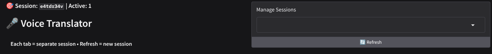
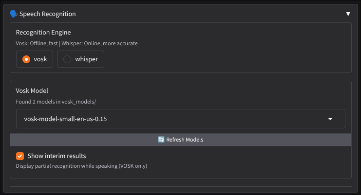
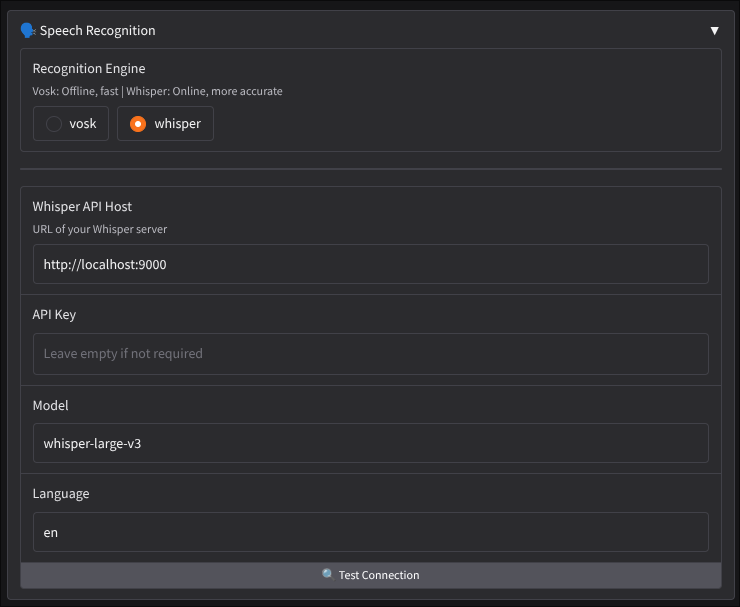
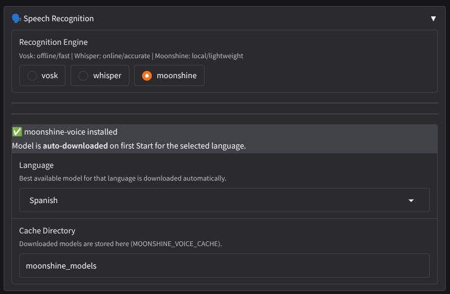
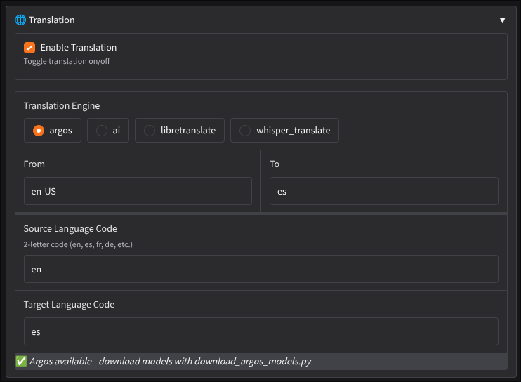
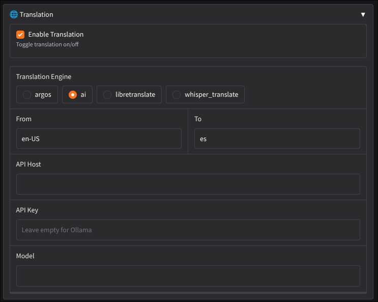
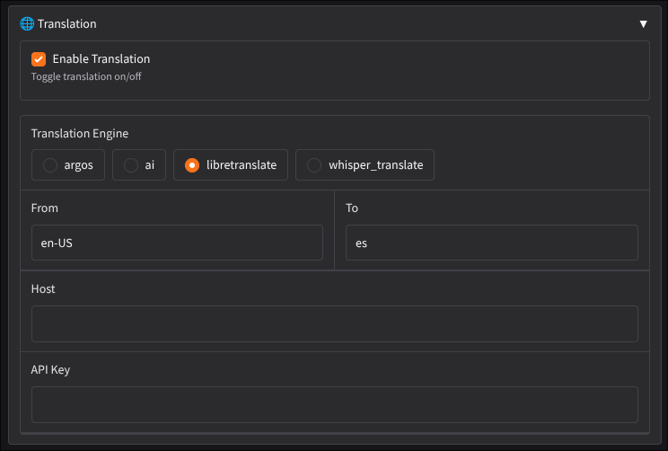
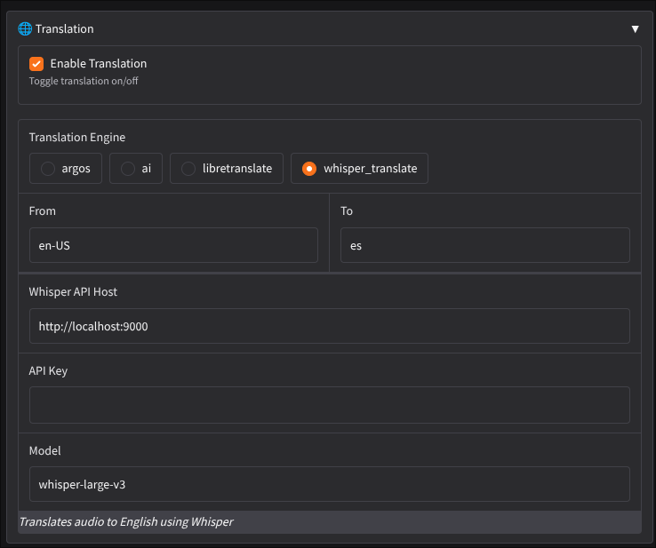
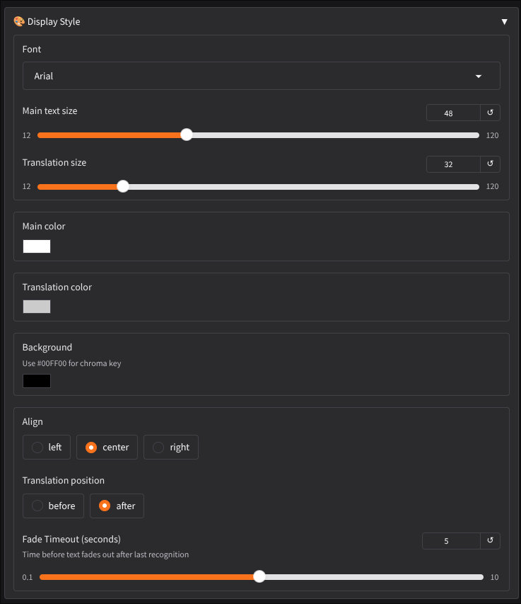
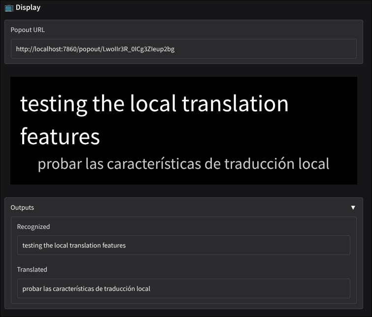

# ⚠️ **AI ALERT**

As a software developer with limited Python expertise, I directed the development of srt-translator by iteratively prompting AI language models (Claude and DeepSeek) to generate the majority of the code. Through systematic debugging, precise requirements, and continuous validation of the AI's output, I guided the project from concept to a fully functional application. This process demonstrates my ability to leverage AI tools effectively while retaining full ownership of problem‑solving and architectural decisions.

# 🎤 Voice Translator - Real-time Speech Recognition & Translation

A powerful, OBS-compatible voice recognition and translation app built with Python and Gradio. Supports multiple translation backends including AI models, offline Argos Translate, Whisper API, and LibreTranslate.

## ✨ Features

### Core Functionality

- **Real-time Voice Recognition** using Vosk (offline, open‑source), Whisper API (online, high accuracy), or Moonshine (offline, lightweight ONNX)
- **Multiple Translation Backends**:
  - **Argos Translate** – offline, open‑source translation (no internet required)
  - **AI‑powered translation** – OpenAI‑compatible endpoints (Ollama, OpenAI, etc.), with the prompt, endpoint URL, request body shape, and response parsing all independently editable for non-standard APIs — see [AI_TRANSLATION.md](./AI_TRANSLATION.md)
  - **Whisper Translate** – direct audio translation via Whisper API
  - **LibreTranslate** – self‑hosted or cloud translation service
  - **Internal translation** – using `translators` library (Google Translate, etc.)
  - **Moonshine** – lightweight ONNX‑based local ASR. Auto‑downloads models from HuggingFace. Supports 8+ languages.
- **Persistent, Named Sessions** – open `?session=<name>` (or `/<name>` behind a reverse-proxy rewrite) to get a session with its own settings that survives reloads, reconnects, and new tabs — it's freed only when you explicitly close it, never automatically. A plain visit with no name gives you the same stable `main` session every time. See [SESSIONS.md](./SESSIONS.md)
- **Self-healing audio** – browser audio is captured on its own audio thread and reconnects by itself after a network blip; after a page reload a running browser-mic session re-attaches the mic automatically
- **Auto-stop when the audio source is lost** – an unplugged mic or server device, a stopped tab share, or a closed tab stops recognition instead of leaving it "running" with no audio (configurable, 0 = off)
- **Any Audio Source** – a server-side input device (including a virtual/loopback device routed from another app, e.g. Discord's desktop client), this device's browser microphone, or a shared browser tab/window/screen's audio (e.g. Discord in a browser tab, or Windows/ChromeOS system audio) — see [AUDIO_SOURCES.md](./AUDIO_SOURCES.md)
- **Discord Voice Channel captions** – a bot joins your voice channel and captions (and translates) every speaker separately, with their avatar and name, as stacked rows in the OBS popout. See [DISCORD.md](./DISCORD.md)
- **Live Whisper captions** – text appears while you're still talking (long speech is sent in pieces, plus live partial captions), requests never pile up behind a slow server, and greedy low-latency decoding is on by default — see [RECOGNITION_QUALITY.md](./RECOGNITION_QUALITY.md)
- **Shared Model Loading** – two sessions using the *same* Vosk model share one copy in RAM instead of loading it twice
- **Pop‑out Display** – separate window for OBS overlay; its ID is saved per session so the OBS URL survives restarts, and it restyles itself when you change display settings
- **Interim Results** – show partial recognition as you speak
- **Multi‑language Support** – recognize and translate between many languages

### Display Customization

- **Font, Size, Color** – fully customizable for both recognized and translated text
- **Text Alignment** – left, center, or right
- **Vertical Position** – top, middle, or bottom (bottom + a stream-sized popout = classic subtitles)
- **Translation Position** – before or after the recognized text
- **Background Color** – set any color (use `#00FF00` for chroma key)
- **Fade Timeout** – automatically fade text after a configurable pause
- **Paced/Buffered Subtitle Mode** – each chunk is held on screen long enough to read both the recognized *and* translated text at your chosen reading speed, whichever is longer

### Advanced Features

- **Microphone Selection** – choose from available input devices
- **Vosk Model Management** – load models from local `vosk_models/` directory
- **Argos Model Management** – download and install offline translation models with `download_argos_model.py`
- **Whisper API Integration** – use any OpenAI‑compatible Whisper server (e.g., `whisper.cpp`, `faster-whisper`); confidence thresholds (no-speech, log-prob, compression-ratio) are enforced client-side against the actual response, not just sent as unverified request params
- **Hallucination guard** – desk knocks, clicks and coughs never reach Whisper (only sounds with enough actual speech are sent), and known "Thank you" / "Subscribe" / subtitle-credit outputs are filtered in several languages
- **Any input device sample rate** – server devices that can't record at 16 kHz are opened at their native rate and resampled
- **Docker Support** – easy deployment with Docker/Docker Compose
- **Comprehensive Logging** – real‑time logs in UI and persistent file logs
- **Crash-safe start/stop** – starting and stopping recognition (including double-clicks and fast start-then-stop) is serialized so it can't race and crash the process

## Screenshots

> The screenshots below predate the session/audio-source updates and may not
> exactly match the current UI in those two areas — everything else is
> still accurate.

#### Session Management



#### Vosk



#### Whisper



#### Moonshine



### Mic options



### Translation

#### Argos


#### AI



#### Libretranslate



#### Whisper translate


### Display



### Display Style



### Subtitle Timing



### Discord Voice Channel

<!-- Placeholder: add the screenshots as images/discord-settings.png and
     images/discord-popout.png and they'll show up here. -->

#### Settings


#### Per-speaker captions in the OBS popout


## 📋 Requirements

### System Requirements

- **Python 3.11 or 3.12** (recommended – Python 3.14 may have package compatibility issues)
- PortAudio (for audio input)
- Vosk models (download separately)
- (Optional) Argos Translate models for offline translation
- (Optional) Whisper server for online transcription/translation

### Python Dependencies

See `requirements.txt` for the full, current list (gradio, vosk, sounddevice, moonshine-voice, webrtcvad, numpy, requests, translators, argostranslate, and a few supporting packages). For running the test suite, see `requirements-dev.txt`.

## 🚀 Installation

### Method 1: Local Installation

1. **Clone or download this repository**

2. **Install system dependencies** (if needed)

   **Ubuntu/Debian:**

   ```bash
   sudo apt-get update
   sudo apt-get install portaudio19-dev python3-pyaudio
   ```

   **macOS:**

   ```bash
   brew install portaudio
   ```

3. **Create and activate a virtual environment**

   ```bash
   python3 -m venv venv
   source venv/bin/activate # On Windows: venv\Scripts\activate
   ```

4. **Install Python dependencies**

   ```bash
   pip install -r requirements.txt
   ```

5. **Download Vosk models**

   Use the included `download_vosk_models.py` script:

   ```bash
   python download_vosk_models.py en-us-small # light English model
   python download_vosk_models.py en-us # full English model
   python download_vosk_models.py es fr de # multiple languages
   ```

   Models are placed in the `vosk_models/` directory.

6. **(Optional) Download Argos Translate models for offline translation**

   ```bash
   python download_argos_model.py en es # install English→Spanish
   python download_argos_model.py --common # install a set of common pairs
   ```

   Models are stored in `argos_models/`.

7. **Run the application**

   ```bash
   python voice_translator.py
   ```

   Open your browser at http://localhost:7860.

### Method 2: Docker Deployment

1. Build the Docker image

   ```bash
   docker compose build
   ```

2. Place Vosk models in `./vosk_models/` (created automatically if missing)

3. Start the container

   ```bash
   docker compose up -d
   ```

4. Access the application at `http://localhost:7860`

### Docker – Additional Notes

- **Building the image** requires internet access to download `gcc` and Python headers inside the container; these build tools are removed again afterward to keep the image slim.
- **Audio access** on Linux requires the `--device /dev/snd` flag (already in `docker-compose.yml`). On macOS/Windows, Docker Desktop may have limited audio support; use browser audio mode instead.
- **Moonshine (local ONNX model)** is included in `requirements.txt` by default now.
- **Volume mounts** – the compose file mounts `./vosk_models`, `./argos_models`, `./moonshine_models`, `./fonts`, `./logs`, and **`./settings`** (this last one is important — it's where every named session's settings actually live; without it, all settings are lost on every container restart). Create these directories on your host before starting the container, or let Compose create them automatically.
- **Sessions are permanent by default** — silence never stops a session, however long it lasts. Recognition only stops by itself when the audio source is actually gone (see *Auto-stop when audio is lost* in the Audio settings). `IDLE_SESSION_TIMEOUT_SECONDS` in `docker-compose.yml` is opt-in (off by default, `0`) and even when set only ever considers *stopped* sessions left idle, never a running one. See [SESSIONS.md](./SESSIONS.md).
- **Discord support** — the image also contains Node.js and the Discord bridge's packages (a separate build stage). A bot token can go in `DISCORD_BOT_TOKEN`, or per session in the UI. See [DISCORD.md](./DISCORD.md).
- **Updating** — copy the files over as-is (all `.py` files plus the `discord_bridge/` folder without `node_modules`) and rebuild with `docker compose up -d --build`; the Python files are baked into the image, so a restart alone doesn't pick them up.

### `docker-compose.yml`

The file in this repo is the source of truth — it includes the settings volume and session-timeout env var described above. A trimmed example:

```yaml
services:
  voice-translator:
    build: .
    container_name: voice-translator
    volumes:
      - ./vosk_models:/app/vosk_models
      - ./argos_models:/app/argos_models
      - ./moonshine_models:/app/moonshine_models
      - ./fonts:/app/fonts
      - ./logs:/app/logs
      - ./settings:/app/settings # per-session settings — required for persistence across restarts
    devices:
      - /dev/snd:/dev/snd
    environment:
      - GRADIO_SERVER_NAME=0.0.0.0
      - GRADIO_SERVER_PORT=7860
      # - IDLE_SESSION_TIMEOUT_SECONDS=21600  # opt-in; 0/unset = never auto-close
      # - DISCORD_BOT_TOKEN=                   # optional; see DISCORD.md
    restart: unless-stopped
```

## 🎮 Usage

### Basic Setup

1. **Select Recognition Engine:**
   - **Vosk** (offline, fast) – choose a model from the dropdown
   - **Whisper** (online, more accurate) – configure Whisper API host and model
   - **Moonshine** (offline, lightweight) – choose a language, model downloads automatically

2. **Choose Audio Source:**
   - **Server Audio Device** – any input device the server can see, including a virtual/loopback device if you route another app's output through one (see [AUDIO_SOURCES.md](./AUDIO_SOURCES.md))
   - **Browser Microphone** – this device's mic, streamed over the network
   - **Browser Tab / System Audio** – share a browser tab, window, or screen with "share audio" checked (e.g. a Discord web tab, or Windows/ChromeOS system audio)
   - **Discord Voice Channel** – a bot joins the voice channel you're in and captions each speaker separately (see [🎧 Discord](#-discord-voice-channel) below)

3. **Configure Translation** (optional):
   - **Argos** – offline translation using downloaded Argos models
   - **AI** – OpenAI‑compatible endpoint (e.g., Ollama, OpenAI) — see [AI_TRANSLATION.md](./AI_TRANSLATION.md) for editing the prompt/endpoint/request/response shape
   - **Whisper Translate** – direct audio translation via Whisper API
   - **LibreTranslate** – self‑hosted or cloud instance
   - **Internal** – uses Google Translate (internet required)

4. **Set Source and Target Languages** (format: `en-US` for Vosk/Whisper, `en` for translation)

5. **Click "Start"** – begin speaking. The recognized text and its translation appear in the display panel.

6. **Use the Pop‑out URL** for OBS – open the provided URL in a browser source in OBS.

### Translation Configuration Examples

**Argos (Offline)**

```text
Translation Mode: argos
Source Language Code: en
Target Language Code: es
```

_Requires the corresponding Argos models installed._

**AI (Ollama)**

```text
Translation Mode: ai
AI Host: http://localhost:11434
AI Model: llama3.2
(Leave API key empty — /v1/chat/completions is appended automatically)
```

**Whisper Translate**

```text
Translation Mode: whisper_translate
Whisper API Host: http://localhost:9000
(Translates audio directly to English)
```

**LibreTranslate (Self‑hosted)**

```text
Translation Mode: libretranslate
LibreTranslate Host: http://localhost:5000
(API key if required)
```

### 🎚️ Voice Activity Detection (VAD)

Adjust when the app detects speech:

- **Threshold (dB)** – sensitivity. Lower values (‑60) detect whispers, higher (‑10) only loud speech.
- **End‑of‑speech pause** – how long silence waits before sending a segment to Whisper/Moonshine (Vosk has its own internal endpointer and isn't affected by this). Default is 300 ms — short pauses (breathing, thinking) shorter than this get fragmented into tiny clips, which is exactly what triggers Whisper to hallucinate filler text like "thank you". Raise further (500–800 ms) if phrases still get cut off; lower it if replies feel laggy.
- **Ignore sounds shorter than** – Whisper only: a sound needs at least this much actual speech (default 200 ms) to be sent, so knocks and clicks don't turn into "Thank you". Lower it if very short replies get dropped.
- **Auto-stop when audio is lost** – stop recognition when the source disappears (default 8 s; 0 = never).
- **Noise filter** – removes clicks, keyboard, and background hum. 0 = off, 1 = aggressive (may soften speech).

### 📺 Subtitle Display Modes

- **Instant** – text appears immediately, fades after timeout.
- **Buffered (paced)** – sentences queue up and are shown in chunks. Each chunk stays on screen long enough to read *both* the recognized and translated text (whichever is longer) at the chosen **characters per second** (CPS). Ideal for fast speakers or Whisper (which sends whole phrases). When translation is on, each utterance is kept as one atomic chunk rather than independently re-splitting the recognized and translated text by their own punctuation — sentence counts routinely don't match across languages, so independent splitting used to produce mismatched or blank-translation pairs.

### ✍️ Text Outline

Add a stroke around recognized and translated text. Useful for better readability on bright backgrounds. Set width (pixels) and color.

### 🔤 Custom Fonts

Place `.ttf`, `.otf`, `.woff`, or `.woff2` files in the `fonts/` directory (created automatically). They appear in the font dropdown as `[Custom] fontname`.

### 🎙️ Microphone Test

Before starting recognition, click **Test Mic** to see the level meter without transcribing. Useful to check your input is working and to set the VAD threshold. Works for all three audio sources, including tab/system audio.

### 👥 Sessions

Sessions are persistent and named, not tied to a browser tab:

- Visit the site with no session specified → you get the same **`main`** session every time, stable across reloads and new tabs.
- Open or create a separate, independently-configured session from the **session switcher** in the header (type a name → **Go**, or **New** for a random one), or by navigating directly to `?session=<name>`.
- A session lives until you explicitly close it (via the **Manage Sessions** panel) — closing a tab, reloading, or a network blip never destroys it. Silence is handled by the recognizer, not by tearing down the session.
- Each session has its own settings, saved independently under `settings/<name>.json`.

Full details, including how to get pretty `/<name>` URLs via an nginx rewrite, in [SESSIONS.md](./SESSIONS.md).

### 🔗 Pop‑out Custom ID

Each session gets a random pop‑out ID the first time it's created. Enter a custom ID (letters, numbers, underscores, hyphens) and press Enter or click away to use a readable URL, e.g., `http://localhost:7860/popout/my_stream`. The ID is saved with the session, so the OBS URL keeps working after restarts, and each ID can only belong to one session.

### 🐳 Docker Audio Passthrough

- **Linux**: Hardware microphone works via `/dev/snd` passthrough (already configured in `docker-compose.yml`).
- **macOS / Windows**: Docker Desktop does not support `/dev/snd`. Use **browser microphone** or **browser tab/system audio** mode instead – both work without host sound device access.

### 🤖 Whisper Advanced Parameters

Expand the **Advanced Whisper Parameters** accordion to fine‑tune transcription (temperature, beam size, no‑speech threshold, etc.). These thresholds are now actually enforced against the response, not just sent as request params — see [RECOGNITION_QUALITY.md](./RECOGNITION_QUALITY.md). See the [OpenAI Whisper API docs](https://platform.openai.com/docs/api-reference/audio/createTranscription) for what each parameter does.

### ⚡ Whisper Live Mode

In the Whisper settings, **Live mode** keeps captions close to real time:
**Low-latency decoding** (greedy, overrides beam size / best-of),
**Live partial captions** (the sentence so far, refreshed while you speak), and
**Max segment length** (long speech is sent in pieces, default 6 s). See
[RECOGNITION_QUALITY.md](./RECOGNITION_QUALITY.md).

### 🎧 Discord Voice Channel

Pick **Discord Voice Channel** as the audio source, enter a bot token and your
Discord user ID, and press Start while you're in a voice channel. The bot
joins, follows you between channels, and each speaker gets their own caption
row (avatar left or right, optional names, max rows on screen). Use **Check
bot** to verify the token and get an invite link, and **Ignore these user IDs**
for people who shouldn't be captioned. Works with Whisper and Vosk. Setup and
limits: [DISCORD.md](./DISCORD.md).

### Display Customization

Open the **Display Style** accordion to adjust:

- Font family, sizes, colors
- Text alignment (left/center/right) and vertical position (top/middle/bottom)
- Translation position (before/after)
- Fade timeout

### OBS Integration

1. Start the app.
2. Copy the **Popout URL** from the UI (e.g., `http://localhost:7860/popout/abc123`).
3. In OBS, add a **Browser Source** and paste the URL.
4. Set desired width/height — e.g. 1920×200 for a caption bar, or 1920×1080 with **Vertical position: Bottom** for subtitles over the whole stream.
5. Optionally add custom CSS to remove background.

Changing display settings in the app updates an open popout by itself — no need to refresh the browser source.

## 📁 Project Structure

```text
voice-translator/
├── voice_translator.py    # Entry point: VoiceTranslatorApp, create_ui(), FastAPI routes, uvicorn.run()
├── session.py              # Persistent session-slug resolution (SessionSlugMiddleware, get_slug)
├── settings_store.py       # Per-slug settings persistence (load/persist, PERSISTABLE_KEYS)
├── vad.py                  # FastVAD — voice activity detection + preprocessing
├── subtitles.py            # SubtitleManager — subtitle buffering/pacing
├── recognizers.py          # ArgosTranslator, WhisperRecognizer, MoonshineRecognizer, hallucination filtering
├── live_whisper.py         # LiveWhisperWorker — ordered, non-backlogging Whisper requests + interim captions
├── audio_input.py          # Server input devices at any sample rate, resampled to 16 kHz
├── discord_source.py       # Starts/talks to the Discord bridge process
├── discord_pipeline.py     # Per-speaker VAD + recognition for the Discord source
├── discord_bridge/         # Node.js Discord bot (bridge.js) that receives each speaker's audio
├── translators.py          # TranslationService — AI / LibreTranslate / Argos dispatch
├── logger.py                # Logging module
├── requirements.txt        # Python dependencies
├── requirements-dev.txt    # + pytest, for running the test suite
├── tests/                  # pytest suite for everything above except the entry point (see below)
├── download_vosk_models.py # Vosk model downloader
├── download_argos_model.py # Argos Translate model downloader
├── Dockerfile               # Docker configuration
├── docker-compose.yml       # Docker Compose
├── README.md                 # This file
├── QUICKSTART.md            # Quick start guide
├── TROUBLESHOOTING.md       # Troubleshooting guide
├── SESSIONS.md               # Named/persistent session design + nginx pretty-URL setup
├── AUDIO_SOURCES.md          # The audio source options, and routing another app's audio in
├── DISCORD.md                # Discord voice channel captions: setup, usage, limits
├── AI_TRANSLATION.md         # Editable AI prompt/endpoint/request/response shape
├── RECOGNITION_QUALITY.md    # VAD tuning + the Whisper hallucination fixes
├── REFACTOR.md               # Why the code is split the way it is, and how it's tested
├── CONFIG_EXAMPLES.txt       # Example configurations
├── vosk_models/              # Vosk models directory
├── argos_models/             # Argos Translate models directory
├── moonshine_models/         # Moonshine models directory (auto-downloaded)
├── settings/                  # Per-session settings (one JSON file per session name)
└── logs/                      # Application logs
```

`voice_translator.py` still holds `VoiceTranslatorApp` and `create_ui()` — the orchestration layer, deeply tied to Gradio's request model, `sounddevice`, and `vosk`. Everything else was split out specifically because it's self-contained enough to run and test in isolation. See [REFACTOR.md](./REFACTOR.md) for the reasoning.

## 🧪 Testing

```bash
pip install -r requirements-dev.txt
pytest
```

A pytest suite covers `session.py`, `settings_store.py`, `vad.py`,
`subtitles.py`, `recognizers.py`, `translators.py`, `live_whisper.py`,
`audio_input.py` and the Discord bridge — session-slug resolution,
per-session settings persistence, VAD segmentation and knock rejection,
subtitle timing/pacing, per-speaker captions, hallucination filtering,
Whisper request ordering, resampling, and the editable AI prompt/endpoint
logic. The Discord bridge test runs the real Node process in its
fake-speaker mode and is skipped if Node isn't installed. Runs in a few seconds with no vosk models, audio hardware, or
running Gradio server required. See [REFACTOR.md](./REFACTOR.md) for what's
covered and why `voice_translator.py` itself (the Gradio UI + FastAPI
routes) isn't part of the automated suite.

## 🔧 Configuration

### Command Line Arguments

| Argument  | Description                                 |
| --------- | ------------------------------------------- |
| `--host`  | Host to bind to (default: `0.0.0.0`)        |
| `--port`  | Port to bind to (default: `7860`)           |
| `--share` | Create a public share link (Gradio feature) |

### Environment Variables (Docker)

- `GRADIO_SERVER_NAME` – set to `0.0.0.0` inside container
- `GRADIO_SERVER_PORT` – default `7860`
- `IDLE_SESSION_TIMEOUT_SECONDS` – opt-in auto-close for **stopped** sessions left idle this many seconds; `0`/unset (default) disables it entirely. Never affects an actively-listening session regardless of this setting. See [SESSIONS.md](./SESSIONS.md).

## 📊 Logging

- All activities are logged in real‑time in the UI (last 50 entries).
- Logs are also saved to `logs/` with session identifiers.

## 🎯 Use Cases

- **Live Streaming** – real‑time translation overlay for multilingual streams
- **Presentations** – live translation for international audiences
- **Meetings** – real‑time transcription and translation
- **Accessibility** – speech‑to‑text with translation support
- **Language Learning** – see translations as you practice speaking

## 🐛 Troubleshooting

See the [TROUBLESHOOTING.md](./TROUBLESHOOTING.md) file for common issues and solutions.

## 🤝 Contributing

Contributions are welcome! Areas for improvement:

- Additional translation backends
- More display customization options
- Performance optimizations
- Additional language models
- UI/UX enhancements

## 📝 License

This project uses several open‑source components:

- Vosk – Apache 2.0 License
- Gradio – Apache 2.0 License
- Argos Translate – MIT License
- translators – MIT License

## 🙏 Acknowledgments

- Vosk – speech recognition toolkit

- Argos Translate – offline translation library

- Gradio – web UI framework

- LibreTranslate – free and open‑source translation API

- translators – multi‑engine translation library

- Ollama – local AI model runner

Happy Translating! 🌍🎤✨
